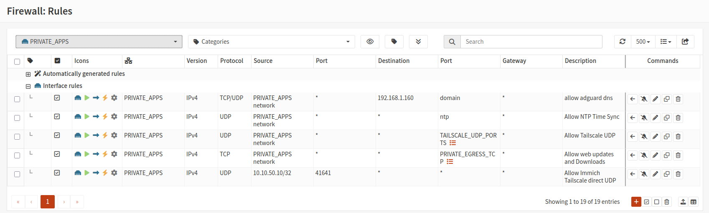

# K15 Network and VLAN Configuration

## VLAN Plan

| VLAN | Name          | Subnet            | Gateway     | Useage                             |
| :--- | :------------ |  :-------------   | :-------    | :--------------------------------  |  
| 10   | INFRA         |   10.10.10.0/24   | 10.10.10.1  | Infrastructure, Monitoring, Admin  |
| 20   | APPS          |   10.10.20.0/24   | 10.10.20.1  | General Apps (Bookmarks,BentoPDF..)|
| 30   | WINDOWS_LAB   |   10.10.30.0/24   | 10.10.30.1  | Windows AD, Windows server testing |
| 40   | SECURITY_LAB  |   10.10.40.0/24   | 10.10.40.1  | Security Testing Labs              |
| 50   | PRIVATE_APPS  |   10.10.50.0/24   | 10.10.50.1  | Private service (Immich,File store)|

### VLAN Naming convention

 #https://docs.opnsense.org/manual/how-tos/vlan_and_lagg.html
vlan0.[VLANID]

Example: vlan0.10, vlan0.50

VLAN Descriptions: VLAN10-INFRA, VLAN50-PRIVATE_APPS

## Netgear Switch Set up

### Port Setup

| Port | Device                |
| ---- | --------------------- |
| 1    | K15 nic0 Home lan     |
| 2    | k15 nic1 Homelab VLAN |
| 3    | Ubuntu Desktop        |
| 4    | Doorbell Hub          |
| 5    | Router uplink         |

### VLAN Configuration on Port 2

Port 2 connects directly to K15 nic1 and therefore to Proxmox vmbr1.

VLAN 10  Tagged
VLAN 20  Tagged
VLAN 30  Tagged
VLAN 40  Tagged
VLAN 50  Tagged
PVID     10

Normal homelab traffic on this trunk is explicitly VLAN-tagged.

### Port 3 desktop configuration

Port 3 carries:

- Untagged home LAN traffic
- Tagged VLAN 10 traffic for the Ubuntu desktop administration interface

This allows the desktop to keep its normal home-LAN Internet connection while also accessing the homelab through VLAN 10.

## Network Overview

K15 Homelab has two physical network interfaces:

| Interface | Proxmox bridge | Use                                        |
| --------- | -------------- | ------------------------------------------ |
| nic0      | vmbr0          | Home lan, Proxmox management, OPNsense WAN |
| nic1      | vmbr1          | VLAN aware homelab trunk                   |

## Proxmox Network Config

### vmbr0

vmbr0 is connected to nic0.

```text
auto vmbr0
iface vmbr0 inet static
        address 192.168.1.150/24
        gateway 192.168.1.1
        bridge-ports nic0
        bridge-stp off
        bridge-fd 0
```

Purpose:

- Proxmox management at 192.168.1.150
- OPNsense WAN
- Access to the existing home LAN 192.168.1.0/24

### vmbr1

vmbr1 is connected to nic1.

```text
auto vmbr1
iface vmbr1 inet manual
        bridge-ports nic1
        bridge-stp off
        bridge-fd 0
        bridge-vlan-aware yes
        bridge-vids 2-4094
```

Purpose:

- Carries tagged homelab VLAN traffic
- No Proxmox host IP address
- No default gateway

## OPNsense

OPNsense running on proxmox VM 120, IP : 10.10.10.1

### OPNsense Firewall Policy

### Admin desktop access

Action:      Pass
Protocol:    IPv4 any
Source:      ADMIN_DESKTOP
Destination: LAB_NETWORKS

Aliases:

ADMIN_DESKTOP = 10.10.10.2
LAB_NETWORKS  = 10.10.0.0/16

### Monitoring access

Action:           Pass
Protocol:         IPv4 TCP
Source:           MONITORING_SERVER
Destination:      LAB_NETWORKS
Destination port: MONITORING_PORTS

Aliases:

MONITORING_SERVER = 10.10.10.10
MONITORING_PORTS  = 9100

### Block general INFRA-to-lab access

Action:      Block
Protocol:    IPv4 any
Source:      LAN network
Destination: LAB_NETWORKS

### INFRA outbound access

Action:      Pass
Protocol:    IPv4 any
Source:      LAN network
Destination: any

The original default IPv4 `LAN network -> any` rule is disabled.


### VLAN50 Private APPS Firewall Rules

DNS is restricted to Adguard

NTP is allowed for time synchronisation.

TCP 80 and 443 are used for package downloads, Docker image retrieval, Immich updates, and Tailscale control/DERP connectivity.

UDP 3478 and 41641 support Tailscale NAT traversal and direct peer connectivity.

The host-scoped rule from 10.10.50.10, source port 41641, was added specifically for the Immich VM after its Tailscale connection was using the London DERP relay instead of a direct peer-to-peer path.


